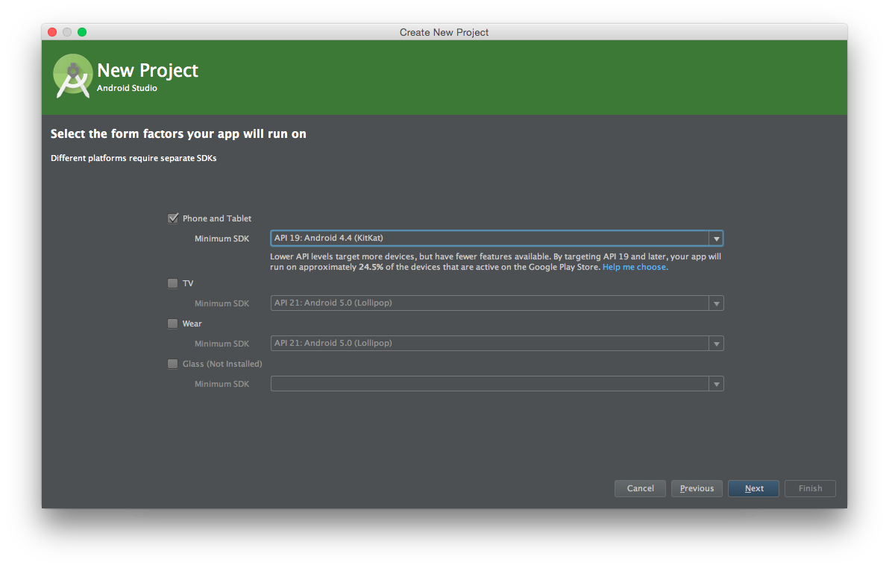

#Homework 1

Welcome. My purpose is to show you how layouts and UI work in android, as well as teaching you the basics of github.
Now to begin, clone this repository, where you will be demonstrating your prowess of android UIs and Layouts.
However, you may need some help along the way. To make your life easier, most, if not all, of the resources you require will be listed here.
Do not see their use as a weakness. In fact, navigating documentation is another key skill that even MLG Programmers make use of from time to time.

[Android Developer Website](http://developer.android.com/training/index.html)

Alright, so, on to the good stuff: the project. 
To begin, create a new android project, and name it whatever your heart desires. However, you will soon encounter a screen that looks something like this:

Worry not! For I am here to tell you that setting it to API 19: Android 4.4(KitKat) will suffice for now. May I advise you, however, that whenever there are unfamiliar terms such as SDK or API, it is helpful to look up and at least have a basic understanding of what they mean. 
Anyway, continue hitting next and then finish. 

And Voila! You have created your first android application!

Now, it may be helpful to tell you upfront that you will be building a live chat app throughout this process, and that each part builds upon the next. So, it is advisable to do a good job on each part, or it may come back and bite you. Good Luck!
