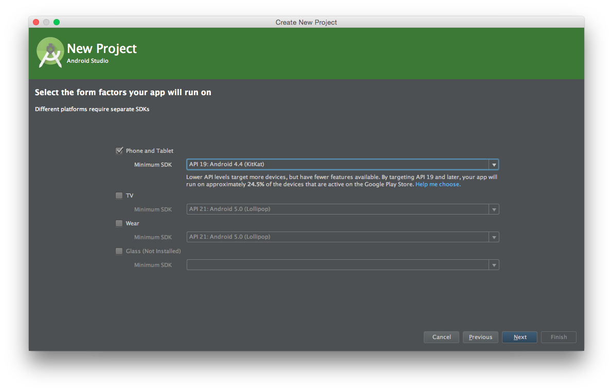
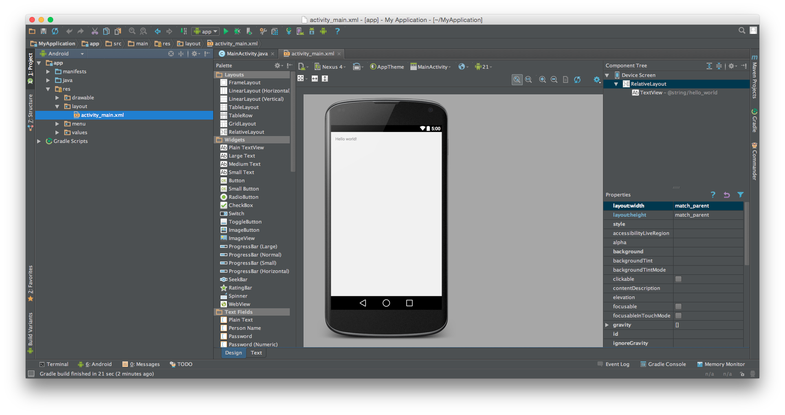
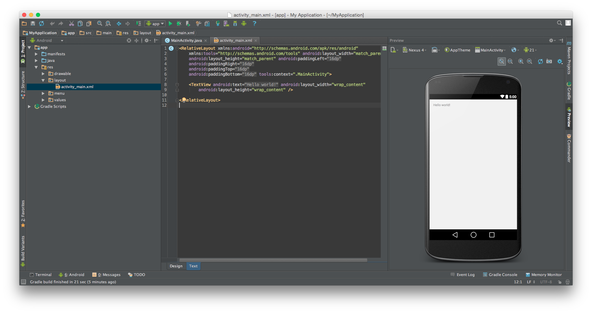

#Homework 1

Welcome. My purpose is to show you how layouts and UI work in android, as well as teaching you the basics of github.
Now to begin, clone this repository, where you will be demonstrating your prowess of android UIs and Layouts.
However, you may need some help along the way. To make your life easier, most, if not all, of the resources you require will be listed here.  There will be many links throughout the homework.  They aren't required reading, but they might be helpful if you get stuck!
Do not see their use as a weakness. In fact, navigating documentation is another key skill that even MLG Programmers make use of ~~from time to time~~ all day every day.

[Android Developer Website](http://developer.android.com/training/index.html)

Alright, so, on to the good stuff: the project. 

You'll be making a live chat app.  In this homework assignment, you'll create the layout for the first screen that the user will see.

To begin, create a new android project, and name it whatever your heart desires. However, you will soon encounter a screen that looks something like this:


Worry not! For I am here to tell you that setting it to API 19: Android 4.4(KitKat) will suffice for now. May I advise you, however, that whenever there are unfamiliar terms such as SDK or API, it is helpful to look up and at least have a basic understanding of what they mean. 
Anyway, continue hitting next and then finish. 

And Voila! You have created your first android application!
Now, you're faced with this scary interface: 

Do not fret, just navigate to the tab called activity_main.xml, and click the text tab.
You should be around here: 

Now, drumroll please, here is the game!
You must make an interface that conforms to the following specifications:

1. It must contain two [EditText](https://developer.android.com/reference/android/widget/EditText.html)s.  One EditText will be for the user to enter the name of the chat room that they want to join, and one EditText will be for the user's username.
2. Each EditText must have a [TextView](https://developer.android.com/reference/android/widget/TextView.html) to label what it's for.
3. Just below that, you'll have a [RelativeLayout](https://developer.android.com/reference/android/widget/RelativeLayout.html).  Inside the RelativeLayout, you'll have a [Switch](https://developer.android.com/reference/android/widget/Switch.html) that will enable Incognito Mode.  In this mode, users won't anounce that they're entering a chat room.  Perfect for spying on your friends!  You'll also have a TextView in the RelativeLayout, to tell the user what the Switch does.
4. Just below that, place a [Button](https://developer.android.com/reference/android/widget/Button.html) that the user will press to enter the chat room.
5. ????
6. Profit
7. For bonus points, Make all of it neon green (Hint: use #5BE300, you'll understand once you get there)

When you are done, you should have something that resembles this screen:


It may be helpful to tell you upfront that each homework assignment builds upon the next. So, it is advisable to do a good job on each part, or it may come back and bite you. Good Luck!

Now, on to a quick explanation of layouts in Android.  Android uses a language called [XML](https://en.wikipedia.org/wiki/XML) to tell your phone what to display.  Here's an example of the XML that you would use to make a TextView (You may want to use this code in your app):

```xml
<TextView
        android:layout_width="wrap_content"
        android:layout_height="wrap_content"
        android:text="Chatroom Name"
        android:id="@+id/chatroomNameTextView"
        android:layout_alignParentTop="true"
        android:layout_alignParentStart="true" />
```

Let's go through this line-by-line and see what it's doing.

`<TextView` says that this is a TextView.  Who would have guessed?

`android:layout_width="wrap_content"` sets the width of this element to be the same as the width of the text inside it.  You can also set this to be `fill_parent`, to make the width be the same as the width of the thing that it's inside.

`android:layout_height="wrap_content"`: You should be able to figure this one out by yourself :)

`android:text="Chatroom Name"` sets the text that you want the TextView to display.

`android:id="@+id/chatroomNameTextView"` sets the [ID](https://developer.android.com/guide/topics/ui/declaring-layout.html#id) of this element.  You don't have to worry about this now, but it will become important in the next homework assignments, so make it something descriptive.  For example, `chatroomNameTextView` is fairly short and describes what the element is, and is thus a good ID.  Some examples of bad IDs are `asdf` and `thingy`.  You can't use the same ID for two different elements.

`android:layout_alignParentTop="true"` says that the TextView should appear at the top of the thing that it's inside.  You can also do things like `android:layout_alignParentBottom="true"`, if you want the element to show up at the bottom of the thing that it's inside.

`android:layout_alignParentStart="true"` is similar to `layout_alignParentTop`, but it describes the position of the element on the X axis.  `layout_alignParentStart` will [usually](http://ask.ttwait.com/que/27934512) set it to the left edge of the screen.  As you might imagine, you can also use `layout_alignParentEnd` to align it to the other side of the screen.

Lastly, you might notice the `/>` at the end of the statment.  This closes the tag, basically telling the computer, "hey, I'm done here.  Time to move on to the next element."

One more thing that might be useful: using the line `android:layout_below="@+id/someRandomId"` will make the element that it's in appear below the element with the ID `someRandomId`.

Now go ahead and make the first two TextViews and EditTexts now!

---

Once you're done with that, you'll want to move on to RelativeLayouts.  A RelativeLayout is basically an object that can hold other objects inside it.  In fact, you're been using a RelativeLayout this whole time!  If you scroll to the top of your `activity_main.xml` file, you'll see a line that looks similar to `<RelativeLayout xmlns:android="http://schemas.android.com/apk/res/android"`.  You're going to create your own RelativeLayout inside this RelativeLayout.  Inside it, you'll put a TextView and a Switch.  See if you can use the [RelativeLayout Documentation](https://developer.android.com/reference/android/widget/RelativeLayout.html) to figure out how to make one!

---

Once you've got a RelativeLayout, add a TextView and a Switch.  The textview should appear on the left side of the screen, and the switch should appear on the right side.  (Remember `layout_alignParentStart`?)

---

And for the finishing touch, add a [Button](https://developer.android.com/reference/android/widget/Button.html).  You might want to use `android:layout_centerHorizontal="true"` to make it appear in the center of the screen.

---

At this point, you should have the basic user interface for the chat app.  Click the green arrow button (Or press Shift+F10) to run the app!  If there are any errors, Android Studio should alert you to this fact by opening a window that will have a small, red exclamation mark on it, along with an error message.  If you run into an error message, you can choose to [try to find out how to fix it yourself](https://google.com), or you can find a more senior app programmer to help you fix it.

Assuming everything works as expected, it's time to move on to [Homework #2](HOMEWORK2.md)!
