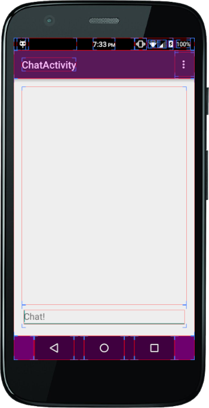

#Homework 2

It's me again!  Today, I'm going to teach you about Intents and Activities in Android.  An Activity is just a fancy word for a specific screen in the app.  The screen that you created in homework 1 was an activity, for example.

In this homework assignment, you'll add a new screen to your application: The screen that you'll see when chatting.  You'll also write code to make the button on the first screen actually do something.

To begin, create a new activity.  You can do this by going to File -> New -> Activity -> Blank Activity.  Name it something along the lines of "ChatActivity", and click Finish.

It's time to use the skills that you learned in homework 1 to create a killer UI.  Here's what it must contain:

* It must have an [EditText](https://developer.android.com/reference/android/widget/EditText.html) at the bottom of the screen.
  * The EditText should have a [hint](https://developer.android.com/reference/android/widget/TextView.html#attr_android:hint) that says something along the lines of "Chat!".
* It must have a [ListView](https://developer.android.com/reference/android/widget/ListView.html) that takes up the rest of the screen, but __does not overlap with the EditText__.
* Has a descriptive ID for every element.

Pretty simple!

Once you have an XML file for your layout, it's time to test it.  If you run the app now, you might notice that nothing is different from the end of homework 1.  Don't panic, this is normal.  You haven't told the phone to display your fancy new activity yet.  To make the activity appear, you'll need to write some code.  Android uses [Java](https://en.wikipedia.org/wiki/Java_%28programming_language%29) to do everything except for layout.  You'll need to write some java code to make the new activity start.

Since you want to make the activity start when the user clicks the "Go!" button in the first activity, you'll use the aptly named `android:onClick` property.  Open the `activity_main.xml` file, and scroll down until you see the Button element.  Add to it `android:onClick="enterChat"`.

Now it's time for some Java.  Open up `MainActivity.java`, and add a function called `enterChat`.  The syntax for creating a new function is:

```java
public void enterChat(View view) {
  // At some point stuff should go here if you want things to work.
}
```

This creates a function that anyone can see (`public`), that doesn't return anything (`void`), and that takes a single [`View`](https://developer.android.com/reference/android/view/View.html) as an argument.

Now for the harder part: Add code inside the function to create a new [Intent](https://developer.android.com/reference/android/content/Intent.html) and use it to start an activity.  Make the intent have three extras: The chatroom name, the username, and a boolean for incognito mode.

[This link might help you](https://developer.android.com/training/basics/firstapp/starting-activity.html).

In the end, it should look like this:


You might be wondering, "How do I check if the ListView overlaps with the EditText?"  Good question.  You can enable a really cool feature called Show Layout Bounds that shows where everything is, even if it's blank.  To enable it, open the settings app on the phone, and scroll all the way to the bottom.  Click on "Developer Options".  Scroll down until you see "Show Layout Bounds" and click it.  Now re-open the app, and you should see something like this:



The large box in the center is the ListView.  If you don't see the small, blue, L shaped line just above the ListView, it's probably overlapping the EditText, and you should fix that.

Well, that is all I have for you today. Best of luck on homework 2 and I will see you in the [following assignment](HOMEWORK3.md)!
