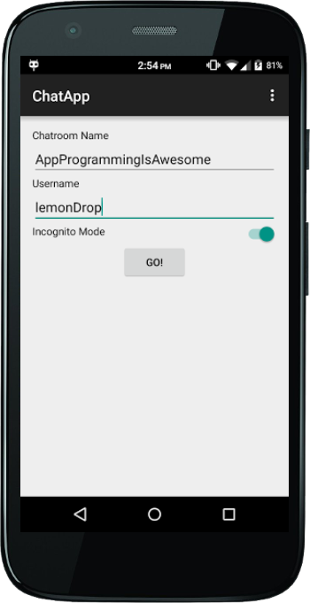
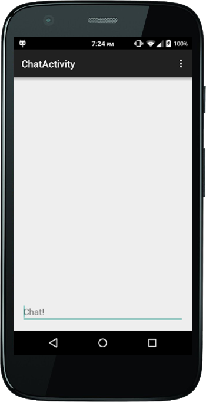

#Homework 3

Welcome back! I must say, you are tenacious. HOWEVER! This project will prove more difficult, and will require even more ingenuity and technique to accomplish. It is about Listviews and, more importantly, creating Listviews programmatically. You see, lists are a very important and effective way to display a lot of information, and is commonly used in many android applications. Learn them, live them, love them. Now, before we begin, here are some useful resources that you may need along your journey:

[ListViews](http://developer.android.com/guide/topics/ui/layout/listview.html)

[ListAdapters](http://developer.android.com/reference/android/widget/ListAdapter.html)

So, since you're here, I assume you've completed homework 2, and you should have an application that looks someting like this:

So, the application is beginning to take shape! But if this chat app is going to work, it will need some way to display the chat messages! But how will that be accomplished?, you may ask. Well, let me introduce ListViews and ListAdapters. Now, you may remember that your app already has an embedded ListView. In layman's terms, a Listview is basically the (scrollable) space on the screen that allows users to look at all the different cells, or in this case, chat messages.

So, to actually put cells in your little ListView, you're going to have to use ListAdapters.

  <pre><code> setListAdapter(new ListAdapter() { </code></pre>
            @Override
            public boolean areAllItemsEnabled() {
                return false;
            }
            
            @Override
            public boolean isEnabled(int position) {
                return false;
            }

            @Override
            public void registerDataSetObserver(DataSetObserver observer) {

            }

            @Override
            public void unregisterDataSetObserver(DataSetObserver observer) {

            }

            @Override
            public int getCount() {
                return 0;
            }

            @Override
            public Object getItem(int position) {
                return null;
            }

            @Override
            public long getItemId(int position) {
                return 0;
            }

            @Override
            public boolean hasStableIds() {
                return false;
            }

            @Override
            public View getView(int position, View convertView, ViewGroup parent) {
                return null;
            }

            @Override
            public int getItemViewType(int position) {
                return 0;
            }

            @Override
            public int getViewTypeCount() {
                return 0;
            }

            @Override
            public boolean isEmpty() {
                return false;
            }
        });
       

Yep, you heard that right. You're going to have to implement that whole mess of code. Hey, its not that bad, really the biggest method that you're going to have to add code is the <code> Public View getView </code> method
However, one more thing before I go: As of right now, there isn't anything to actually put in the cells(we don't have a data source yet), so do not worry about customizing the cells too much(just be sure you know how when the time comes. And trust me, it will come). 

Best of luck, and I'll see you again in homework 4!
